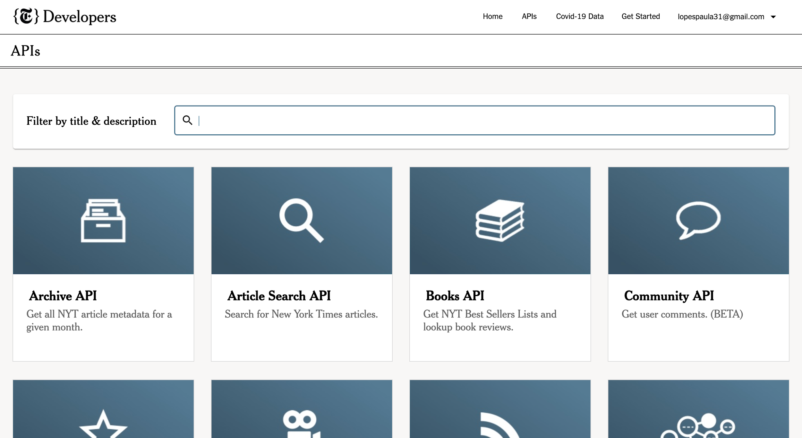
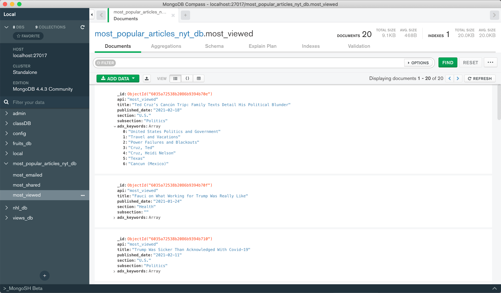
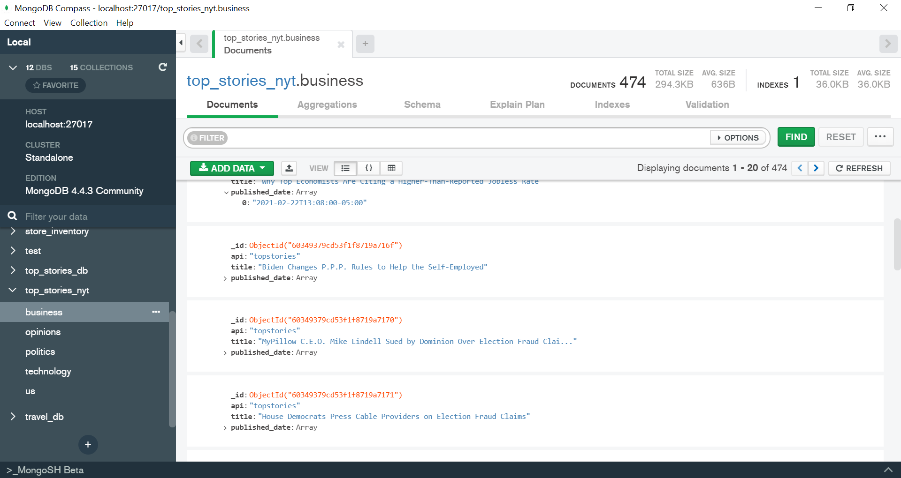
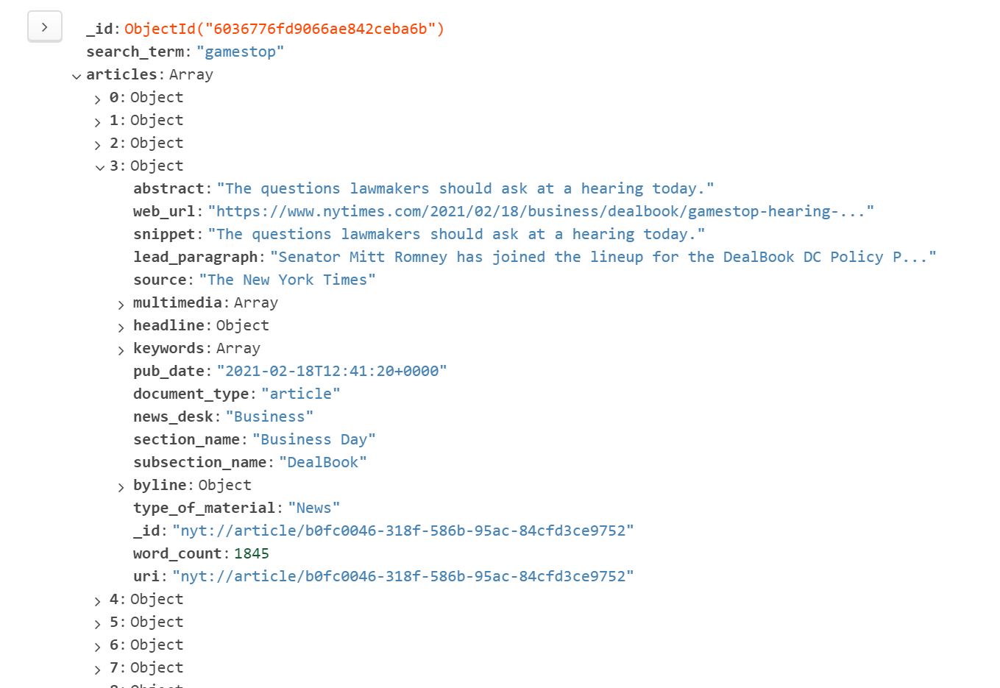
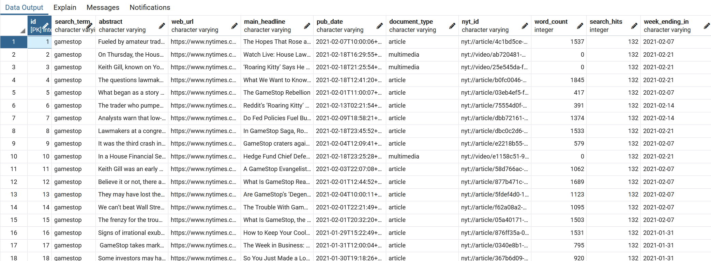
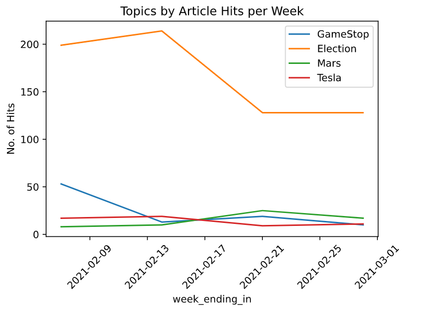

# New York Times Article Data ETL

## Summary
A series of Python scripts that access New York Time's database APIs to query for information on articles through multiple approaches.

## Files Workflow
A no-SQL database was chosen to load the initial data to match the non-normalized JSON data structures of the API responses. 

### Most Popular API
The Most Popular API generated data about the most viewed, most emailed and most shared on facebook articles, in the last 30 days.

### Top Stories API
The Top Stories API generated metadata on all of the articles currently on the landing page for each section of the NYT.  We chose to do Business, Technology, US, Politics, and Opinion sections, where we were able to pull the title and published date information to input into MongoDB.

### Archive API
The Archive API generated metadata on all of the articles within a given month. This metadata was inserted into a Mongo database. From this database, keywords such as “Gamestop” were searchable. 

### Article Search API
The Article Search API generated data about articles based on keyword. In this case we chose specific dates and the keywords "gamestop", "tesla", "mars", "election".

#### Raw Data ETL
Each keyword is given its own collection within the Mongo database, which will list all records that appear within that keyword's API query.

The script app_3_pt1_mongodb_loader.ipynb first creates a raw copy of article data for localized access. The script queries for articles using the selected keywords, retrieving a JSON document. The data is transformed into Python objects for each article, keeping all key-value pairs of the JSON intact. Each object is then loaded into a Mongo database with each article as a database record.

#### Processed Data ETL
The data for each article is then retrieved from the mongoDB, and then cleaned of any unnecessary info within app3_pt2_pgloader.ipynb, and applied into a postgreSQL database. 

With the data cleaned, analyses can now be performed. A simple example analysis of the number of articles generated per keyword can be found in analysis.ipynb.

*The report required for submission can be found in the directory:
common/Team Stonks - Writtern Report.docx
  
## Credits
(2021) The New York Times Company
